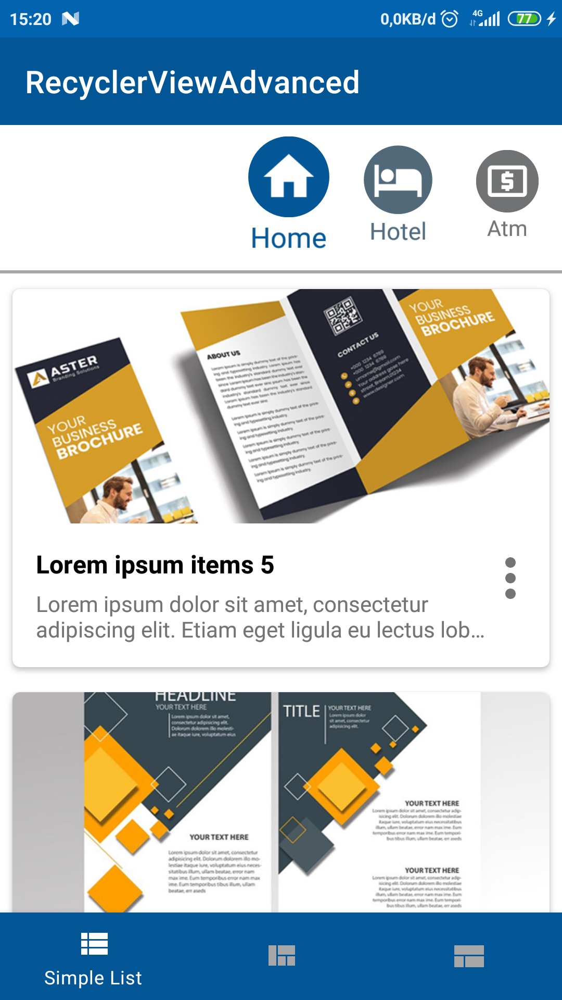
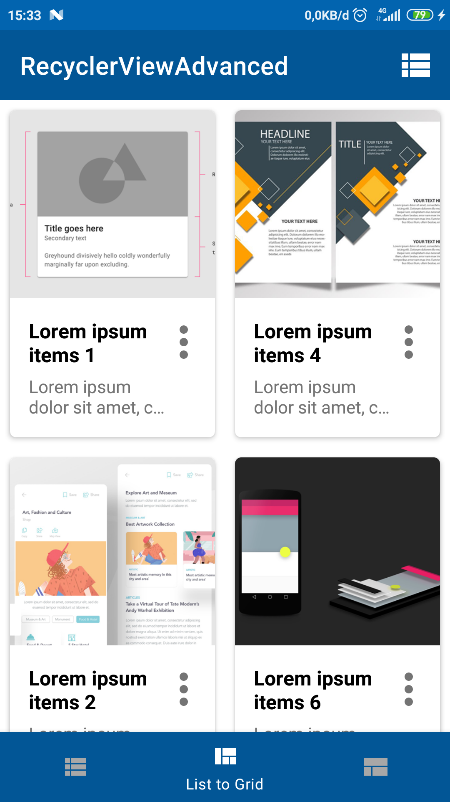
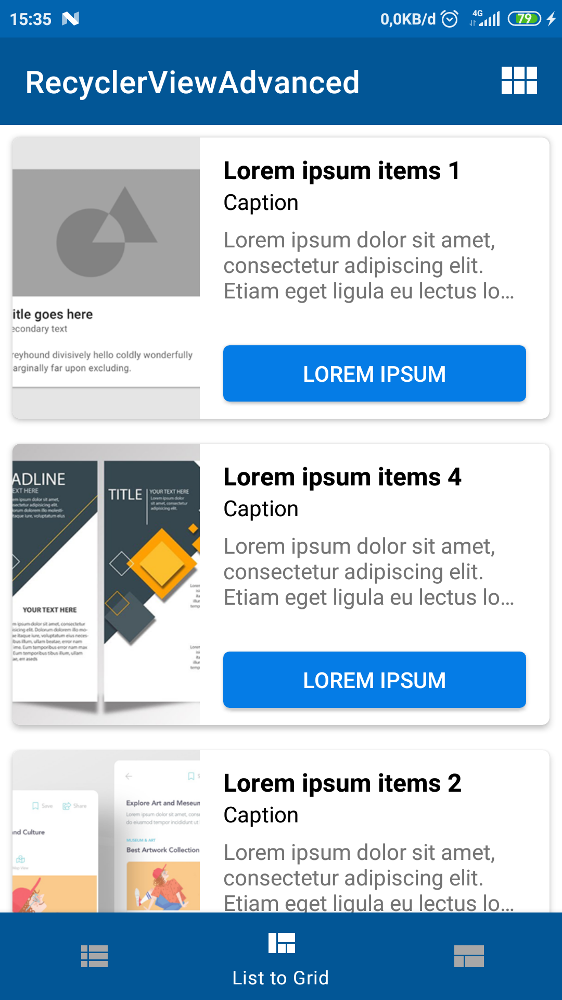
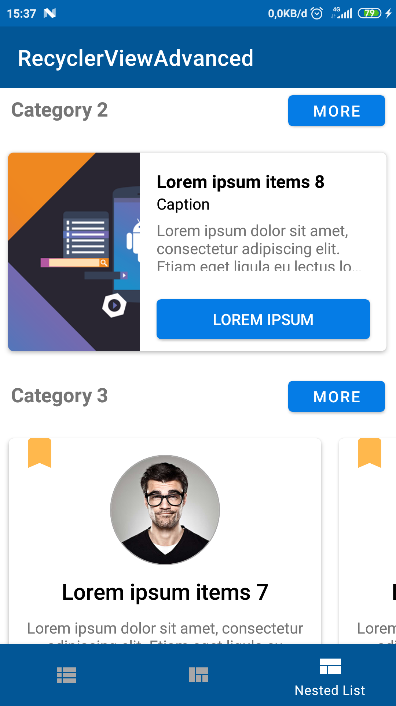

## Recyclerview Advanced

Multiple view with recyclerview

## Features
- Android Kotlin
- Simple Recyclerview
- Change view type (List to Grid)
- Nested and multiple view type

## Screenshots

    
    
    
    

